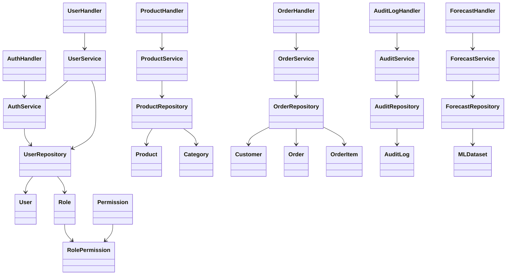

# Class Diagram

## Applied Patterns

- MVC:
  handlers act as controllers, models describe domain entities, frontend pages render views.
- Repository:
  repositories encapsulate persistence and query details.
- Service layer:
  services hold validations, transaction boundaries, and business rules.
