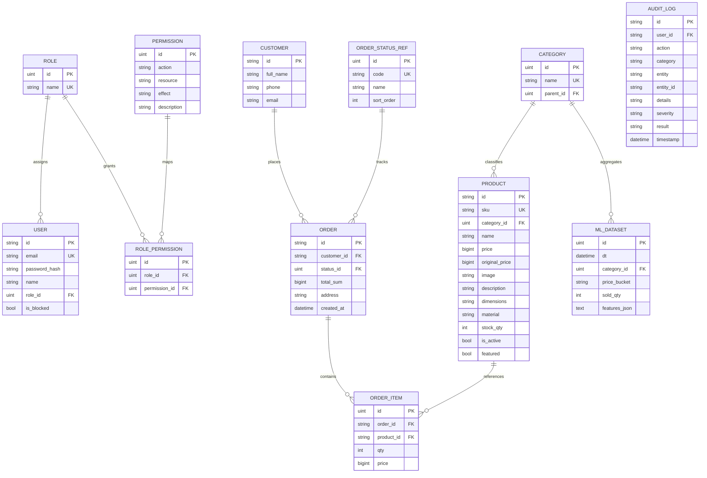

# ER Diagram

## Notes

- Primary keys, foreign keys, uniqueness constraints, and reference tables are represented in the ORM model definitions.
- The schema is normalized around reference entities such as `roles`, `categories`, and `order_status_refs`.
- Role permissions are stored separately from users, which keeps RBAC reference data normalized.
- Order items are stored in a separate table, which keeps the transactional model normalized instead of embedding repeated product data in orders.
